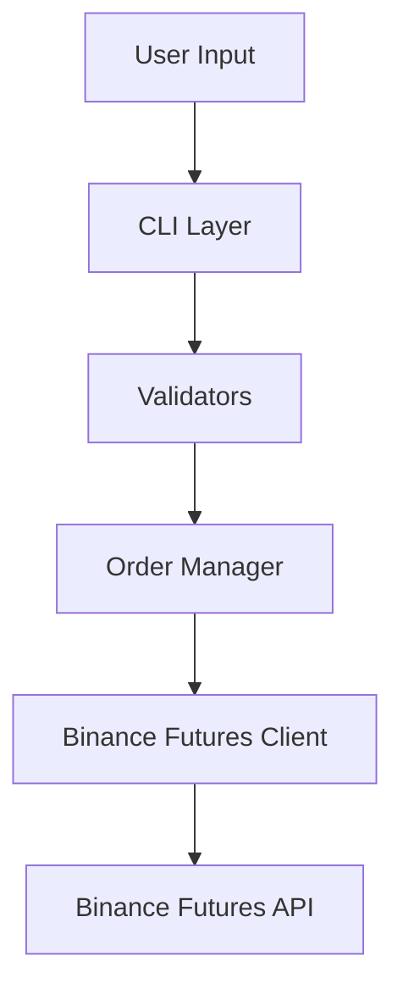

# Trading Bot — Binance Futures Testnet (USDT-M)

A structured Python CLI application for placing MARKET, LIMIT, and STOP-LIMIT
orders on Binance USDT-M Futures. The project focuses on clean architecture,
input validation, robust logging, retry mechanisms, testing, and maintainability.

---

## Key Features

- MARKET, LIMIT, and STOP-LIMIT order support
- BUY and SELL order execution
- Interactive CLI mode
- Dry-run mode for local testing
- Structured rotating logs
- Retry mechanism with exponential backoff
- Unit-tested architecture (29 tests)
- GitHub Actions CI pipeline
- Separation of concerns through layered design
- Typed exceptions and graceful error handling

---

## Architecture



The architecture intentionally separates:

- **CLI Layer** → User interaction
- **Validation Layer** → Input checks and business rules
- **Service Layer** → Order orchestration
- **Client Layer** → API communication

This makes each component independently reusable and testable.

---

## Contents

- [Project Structure](#project-structure)
- [Setup](#setup)
- [Running Examples](#running-examples)
- [Testing](#testing)
- [Error Handling](#error-handling)
- [Design Notes](#design-notes)
- [Assumptions & Limitations](#assumptions--limitations)
- [Future Improvements](#future-improvements)

---

## Project Structure

```text
trading_bot/
│
├── bot/
│   ├── __init__.py
│   ├── client.py
│   ├── orders.py
│   ├── validators.py
│   └── logging_config.py
│
├── tests/
│   ├── test_client.py
│   ├── test_orders.py
│   └── test_validators.py
│
├── logs/
│   └── sample_trading_bot.log
│
├── .github/
│   └── workflows/
│       └── tests.yml
│
├── cli.py
├── requirements.txt
├── requirements-dev.txt
├── pyproject.toml
├── .env.example
├── README.md
└── .gitignore
```

### Component Responsibilities

| Component | Responsibility |
|-----------|---------------|
| `cli.py` | CLI interface and user interaction |
| `client.py` | Binance API communication and request signing |
| `validators.py` | Input validation and business rules |
| `orders.py` | Order orchestration and response formatting |
| `logging_config.py` | Structured rotating logging |
| `tests/` | Unit and integration-style tests |

---

## Setup

### 1. Clone Repository

```bash
git clone <repo-url>
cd trading_bot
```

### 2. Create Virtual Environment

```bash
python -m venv venv
```

Linux/macOS:

```bash
source venv/bin/activate
```

Windows:

```bash
venv\Scripts\activate
```

### 3. Install Dependencies

```bash
pip install -r requirements.txt
```

### 4. Configure Credentials (Optional)

Generate Binance Futures Testnet credentials if available in your region.

Create:

```bash
cp .env.example .env
```

Add:

```env
BINANCE_API_KEY=your_key
BINANCE_API_SECRET=your_secret
```

The application also supports full execution using `--dry-run` without requiring credentials.

---

## Running Examples

### Market Order

```bash
python cli.py \
    --symbol BTCUSDT \
    --side BUY \
    --type MARKET \
    --quantity 0.01
```

---

### Limit Order

```bash
python cli.py \
    --symbol BTCUSDT \
    --side SELL \
    --type LIMIT \
    --quantity 0.01 \
    --price 60000
```

---

### Stop-Limit Order

```bash
python cli.py \
    --symbol ETHUSDT \
    --side SELL \
    --type STOP \
    --quantity 0.5 \
    --price 3000 \
    --stop-price 3050
```

---

### Interactive Mode

```bash
python cli.py --interactive
```

or simply:

```bash
python cli.py
```

---

### Dry Run Mode

```bash
python cli.py \
    --symbol BTCUSDT \
    --side BUY \
    --type MARKET \
    --quantity 0.01 \
    --dry-run
```

Dry-run mode simulates realistic responses locally without requiring network access.

---

## Testing

Install development dependencies:

```bash
pip install -r requirements-dev.txt
```

Run tests:

```bash
pytest -v
```

### Test Coverage

The project currently includes **29 tests**, covering:

- Validation rules
- Retry and backoff mechanisms
- Dry-run functionality
- Network failure handling
- API error handling
- OrderManager behavior
- Mocked client interactions

GitHub Actions automatically executes the test suite on every push and pull request.

---

## Error Handling

The application distinguishes between three failure categories.

### 1. Validation Errors

Examples:

- Missing price on LIMIT order
- Invalid quantity
- Unsupported symbol
- Invalid side or order type

These are detected before any network call.

---

### 2. API Errors

Examples:

- Exchange rejects order
- Invalid symbol
- Insufficient balance
- Filter violations

These raise:

```python
BinanceAPIError
```

API rejections are intentionally **not retried**.

---

### 3. Network Errors

Examples:

- Connection failures
- Timeouts
- HTTP 5xx responses
- Malformed responses

These raise:

```python
BinanceNetworkError
```

Network failures are retried using exponential backoff:

```text
0.5s → 1s → 2s
```

---

## Design Notes

### Why manual REST implementation?

The project uses:

```python
requests + HMAC-SHA256
```

instead of `python-binance` to:

- Maintain a smaller dependency surface
- Improve transparency
- Provide complete request/response logging
- Demonstrate understanding of API authentication

---

### Why layered architecture?

Separating responsibilities improves:

- Testability
- Reusability
- Maintainability
- Future extensibility

---

### Why retry only network failures?

Retrying rejected orders may accidentally duplicate orders.

Therefore:

| Error Type | Retry |
|------------|--------|
| Validation Errors | ❌ |
| API 4xx Errors | ❌ |
| Network/5xx Errors | ✅ |

---

## Assumptions & Limitations

- Limited to USDT-margined futures pairs.
- STOP order type chosen as bonus functionality.
- Binance exchange filters (`LOT_SIZE`, `PRICE_FILTER`) are enforced by the exchange rather than prevalidated locally.
- LIMIT and STOP orders use `GTC` by default.

### Testnet Access Limitation

Due to regional restrictions and identity verification requirements,
live Binance Futures Testnet API execution could not be completed during development.

Therefore, validation was performed using:

- Dry-run execution mode
- Mocked API responses
- Unit tests
- Simulated API failures
- Simulated network failures

`logs/sample_trading_bot.log` contains representative dry-run logs demonstrating the application's behavior.

The client implementation follows Binance Futures API specifications and can be executed directly once valid credentials are available.

---

## Future Improvements

Potential enhancements beyond the scope of this assignment:

- Fetch `/fapi/v1/exchangeInfo`
  for real-time symbol validation.
- OCO order support.
- Order history persistence (SQLite).
- Dockerized deployment.
- WebSocket support for real-time updates.
- Portfolio analytics dashboard.
- Recorded API fixtures for integration testing.
- Lightweight web interface.

---

## CI Pipeline

GitHub Actions automatically:

1. Installs dependencies
2. Runs the complete test suite
3. Executes CLI smoke tests
4. Validates project integrity

---

## Author

Developed as part of the Primetrade.ai Python Developer Internship assignment, with emphasis on:

- Software engineering practices
- Clean architecture
- Testing and maintainability
- Production-oriented error handling
